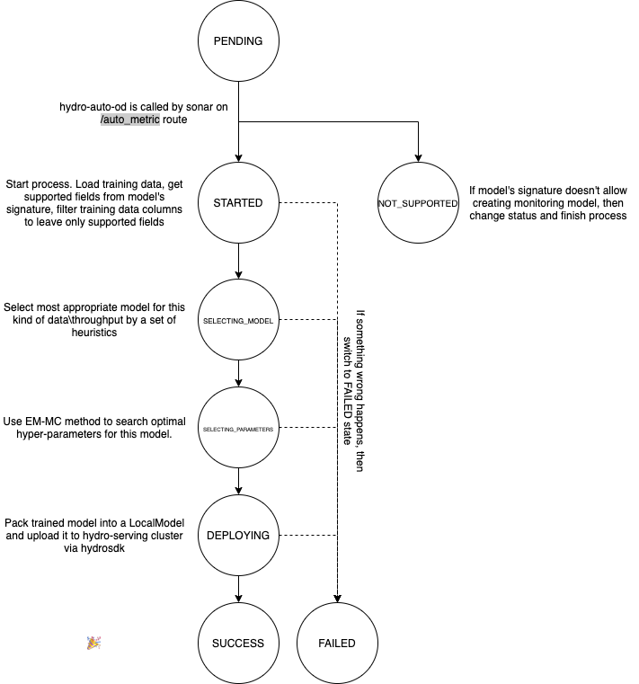

# hydro-auto-od

`hydro-auto-od` service is responsible for creating monitoring metrics for deployed machine learning models via unsuperviesd AutoML techniques. Each time a new model version is uploaded
to the cluster, sonar service calls `hydro-auto-od` service by the `/auto_metric` endpoint.
This launches a process of creating a metric for monitoring this new model. There are more details in Creating Auto Metric State Diagram part.

To use this service, first look at OpenAPI spec in [hydro_auto_od_openapi.yaml](hydro-auto-od-openapi.yaml)

## Creating Auto Metric State Diagram

## Which models are eligible for creating an auto-od metric?
 hydro-auto-od creates metric which uses all supported fields of a model signature. If model 
 signature has no supported fields, then there are no way to create an auto-od metric, and state of training job shall be `SIGNATURE_NOT_SUPPORTED`
 
 Supported fields are:
 * of scalar shape
 * of types:
    * DT_HALF
    * DT_FLOAT
    * DT_DOUBLE
    * DT_INT8
    * DT_INT16
    * DT_INT32
    * DT_INT64
    * DT_UINT8
    * DT_UINT16
    * DT_UINT32
    * DT_UINT64

In future more model fields will be supported.

## Environment variables to configure service while deploying
Addresses to other services:
* `HS_CLUSTER_ADDRESS` - http address of hydro-serving cluster, used to create `hydrosdk.Cluster(HS_CLUSTER_ADDRESS)`

MongoDB parameters:
* `MONGO_URL`
* `MONGO_PORT` 
* `MONGO_AUTH_DB` 
* `MONGO_USER` 
* `MONGO_PASS`
* `AUTO_OD_DB_NAME` - Name of database in mongo which will be used for this service

S3 Access parameters:
* `S3_ENDPOINT` - Points to minio or other self-hosted s3 storage, None if AWS is used
* `AWS_ACCESS_KEY_ID`
* `AWS_SECRET_ACCESS_KEY`

Flask server parameters:
* `APPLICATION_ROOT` - prefix of all routes specified in [hydro_auto_od_openapi.yaml](hydro-auto-od-openapi.yaml)
* `DEBUG`
